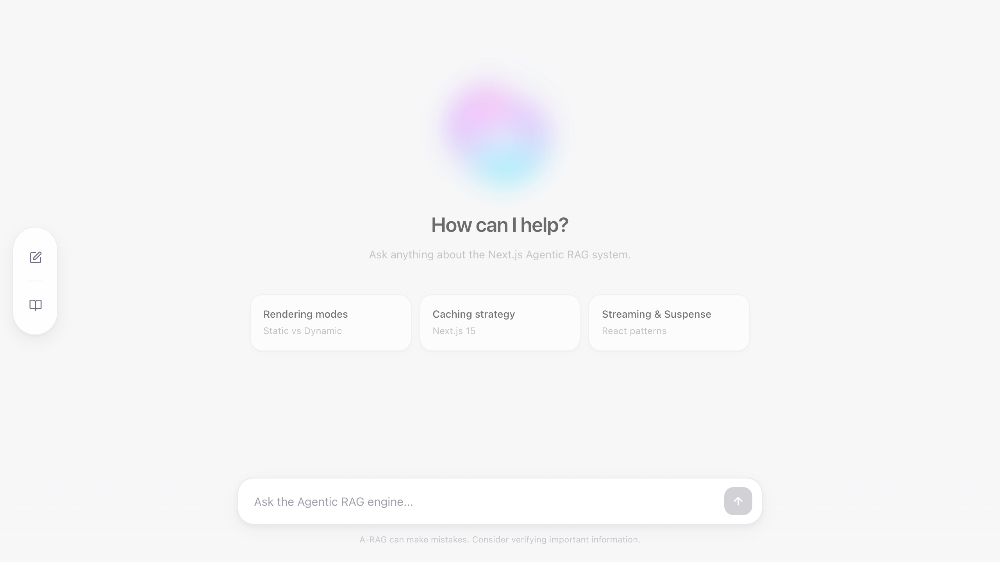
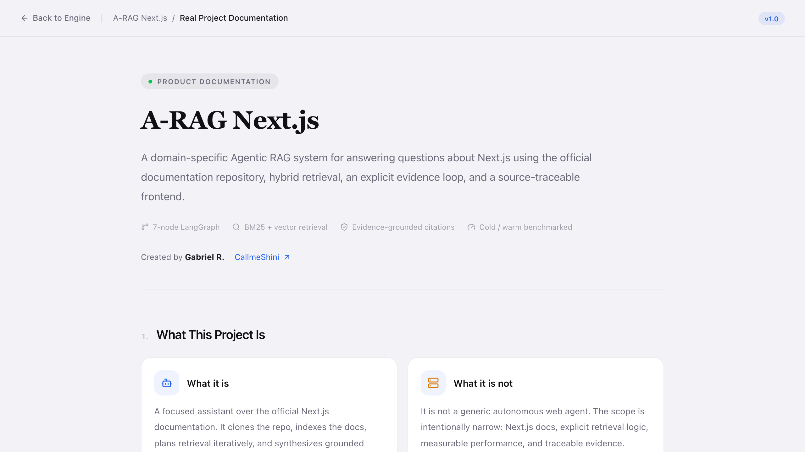

# A-RAG Next.js

An open-source Agentic RAG system for the official Next.js documentation.

Built by Gabriel R. ([CallmeShini](https://github.com/CallmeShini)).


## Overview

A-RAG Next.js is a portfolio-grade AI engineering project focused on a single domain: answering questions about Next.js using the official documentation corpus.

The project is intentionally explicit end to end:

```text
ingestion -> chunking -> retrieval -> reranking -> evidence writing -> synthesis -> evaluation
```

Instead of hiding orchestration behind a single black-box call, the system exposes an inspectable Agentic RAG loop with:

- hybrid retrieval (`BM25 + vector`)
- planner-controlled iteration
- explicit evidence memory
- semantic cache before orchestration
- source-grounded citations
- measurable cold vs warm behavior

This repository is optimized for open-source readability and local reproducibility, not for running as a permanent hosted service.

## Product Preview

### Chat experience



### Project documentation



## Architecture


The implementation follows the project diagram directly:

```text
User Query
  -> Semantic Cache
  -> Planner / Orchestrator
  -> Decomposition Router
  -> Retrieval Specialist
  -> BM25 Retrieval + Vector Retrieval
  -> Reranker
  -> Chunk Reader
  -> Evidence Memory
  -> Planner / Final Synthesizer
```

Core idea:

- the planner decides whether enough evidence exists
- retrieval is split into explicit stages
- retrieved chunks are not treated as evidence automatically
- the chunk reader writes structured evidence back into graph state
- the final synthesizer only runs after the system decides it has enough support

## Why this project matters

The goal is to demonstrate production-minded AI engineering decisions in a narrow and traceable setting:

- explicit architecture instead of opaque chains
- observable retrieval and synthesis behavior
- local evaluation and benchmarking
- source-grounded answers with citations
- reproducible full-stack demo via Docker

Next.js is a strong retrieval domain because the docs mix:

- exact API terms
- file conventions
- configuration-driven behavior
- conceptual guides

That makes it a useful testbed for hybrid retrieval and agentic evidence gathering.

## Key engineering decisions

### 1. Narrow domain, explicit pipeline

This is not a general-purpose autonomous agent. It is a documentation-grounded system specialized in the official Next.js docs.

That constraint improves:

- retrieval quality
- source traceability
- evaluation clarity
- demo reliability

### 2. Hybrid retrieval over vector-only search

Next.js questions often combine exact identifiers and conceptual language. BM25 helps on terms like `generateStaticParams`, `loading.tsx`, or `revalidateTag`, while vector search helps on broader topics like caching, rendering, and streaming.

### 3. Evidence memory as a first-class layer

The project separates:

- relevant chunks
- extracted evidence
- final answer generation

This creates a cleaner planner loop and makes the retrieval path easier to inspect and test.

### 4. Semantic cache as a measurable product feature

Repeated questions should not pay the full orchestration cost. The semantic cache intercepts semantically similar queries before the graph runs, which creates a dramatic warm-path speedup.

### 5. Local retrieval models, configurable generation provider

Embeddings and reranking run locally. The generation layer uses the OpenAI SDK interface with provider adapters, which keeps the retrieval side inexpensive while allowing the LLM endpoint to be swapped.

## Performance snapshot

Local benchmark recorded on `2026-04-09`:

| Mode | Average | Median | Min | Max |
|---|---:|---:|---:|---:|
| Cold | `24.03s` | `18.56s` | `15.74s` | `37.81s` |
| Warm | `0.01s` | `0.01s` | `0.01s` | `0.01s` |

Observed warm-path speedup: `2054.06x`

This benchmark is useful as a relative engineering result, not as a universal SLA. It shows the tradeoff between the full agentic retrieval path and the semantic-cache fast path.

## Project layout

This repository is organized as one product with two internal runtime modules:

- [`api/`](./api/)  
  Core runtime. Includes ingestion, indexing, LangGraph orchestration, FastAPI, tests, and evaluation tooling.

- [`web/`](./web/)  
  User-facing web application. Includes the chat UI, evidence badges, citation cards, and `/docs` product page.

The project identity is A-RAG Next.js. `api` and `web` are implementation modules, not separate products.

## Run the demo locally

The recommended way to run the full stack is Docker Compose.

```bash
docker compose up --build
```

What this gives you:

- API at `http://localhost:8000`
- web app at `http://localhost:3000`
- automatic first-time ingestion if retrieval artifacts do not exist yet

The first startup is intentionally slower because it may:

- clone the Next.js docs repository
- build BM25 and ChromaDB artifacts
- download local retrieval models

## Portfolio strengths

- explicit architecture instead of hidden orchestration
- reproducible local demo
- benchmarked cold vs warm behavior
- source-linked citations
- structured logging and test coverage
- clean, domain-specific problem framing

## Current limitations

- no authentication on `/ask`
- no response streaming yet
- no conversation persistence yet
- optimized for Next.js documentation, not general web QA
- cold-path latency is still materially higher than warm-path latency

## Author

Gabriel R.  
GitHub: [CallmeShini](https://github.com/CallmeShini)

This project is intended to represent AI Engineer work with emphasis on retrieval systems, observability, traceability, evaluation, and maintainable system design.
